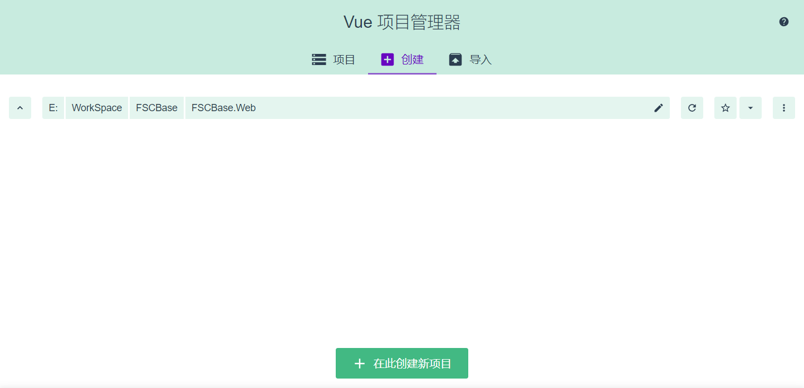
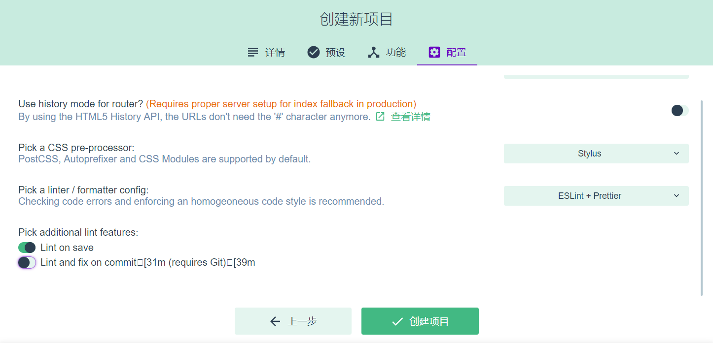
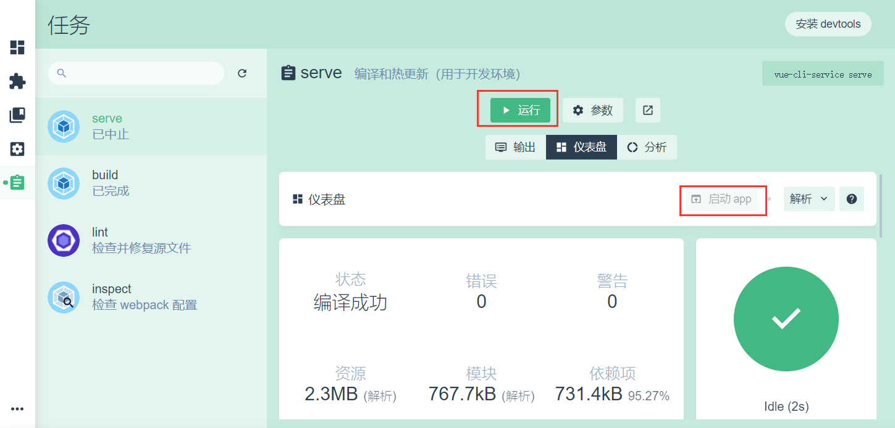
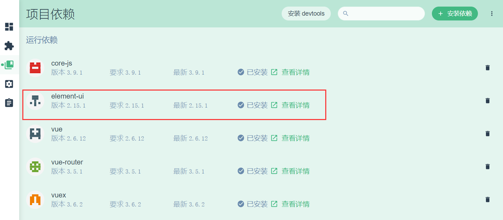
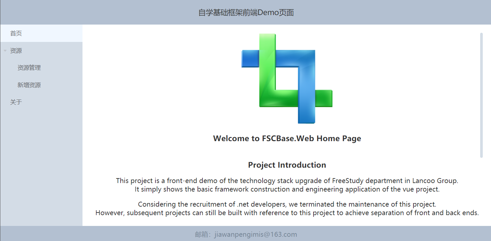

## 项目结构

```
project
│
├───.git  [git本地仓库]
├───.vs  [vs编译器缓存文件]
├───dist  [build生成目录]
├───node_modules  [本地依赖环境]
├───public  [公共文件目录（不压缩）]
│      index.html  [首页]
│      web.config  [IIS配置文件]
├───src  [项目目录]
│   ├───api  [接口层目录]
│   ├───assets  [css,js文件目录（压缩）]
│   ├───components  [组件目录]
│   ├───router  [路由配置目录]
│   ├───store  [状态管理目录]
│   ├───views  [视图层目录]
│       App.vue  [应用程序首页]
│       main.js  [应用程序入口]
│   .env  [vue-cli环境配置文件]
│   .gitignore  [git配置文件]
│   .package.json  [包管理文件]
│   .package-lock.json  [包版本锁定文件]
│   README.md  [git页面描述文件]
│   vue.config.js  [项目配置文件]
```


## 准备项目环境
### 1. 安装nodejs
>下载地址：
>[http://nodejs.cn/download/](http://nodejs.cn/download/)
### 2. 安装淘宝镜像
打开cmd命令行，执行以下脚本：
```text
//切换成淘宝的国内镜像：
npm config set registry https://registry.npm.taobao.org/
//查看是否切换成功：
npm config get registry
//强制清除npm缓存：
npm cache clean --force
//再执行安装npm：
npm install -g npm
```

### 3. 安装脚手架
```text
npm install -g @vue/cli
```

### 4. 测试环境是否成功
```text
vue -V
```

## 创建项目
> [!WARNING]
> 强烈建议以下步骤通过代码完成

### 1. 打开vue图形化操作界面
执行命令 vue ui，自动打开图形化网页进行项目创建


### 2. 选择项目构建配置
选择项目位置，按照图文指引选择手动配置项目，并勾选以下几项：
* Choose Vue Version
* Babel
* Router
* Vuex
* CSS Pre-processors
* Linter / Formatter

在最后配置时选择以下几项，点击创建项目即可完成创建：

### 3. 启动项目
* 点击 serve->运行->启动app ，可以进入项目开发环境首页：
* 点击 build->运行，可以启动项目构建，生成站点在dist文件夹下：


## 完善项目基础设施
### 1. 安装element-ui
在图形界面中安装elementui，用于快速搭建界面：

在main.js中全局引用elementui，如下：
```js
import ElementUI from 'element-ui';
import 'element-ui/lib/theme-chalk/index.css';
Vue.use(ElementUI);
```
### 2. 安装vuescroll
在图形界面中安装vuescroll，用于优化界面滚动条样式，安装步骤同上；<br/>
在main.js中全局引用vuescroll并进行配置，如下：
```js
import vuescroll from 'vuescroll';
Vue.use(vuescroll, {
    ops: {
        vuescroll: {},
        scrollPanel: {
            scrollingX: false
        },
        rail: {},
        bar: {
            onlyShowBarOnScroll: false,
            background: '#D3DCE6'
        }
    }
});
```
### 3. 增加配置文件
由于本次采用的vue-cli4.x版本，脚手架未自带配置文件，因此在项目根目录下新增vue的配置文件vue.config.js，并进行相关配置如下：
```js
// vue.config.js
module.exports = {
    publicPath: '/',
    outputDir: 'dist',
    lintOnSave: true,
    productionSourceMap: false,
    configureWebpack: {
        output: {//配置生成分块js命名规则
            filename: 'js/[name].js?hash=[hash:8]',
            chunkFilename: 'js/[name].chunk.js?hash=[chunkhash:8]'
        }
    },
    chainWebpack: config => {//配置生成分块css命名规则
        config.plugin('extract-css').tap(() => [{
            filename: 'css/[name].css?hash=[hash:8]',
            chunkFilename: 'css/[name].chunk.css?hash=[chunkhash:8]'
        }])
    },
    css: {
        // 是否使用css分离插件 ExtractTextPlugin
        extract: true,
        // 开启 CSS source maps?
        sourceMap: false,
        // css预设器配置项
        loaderOptions: {},
        // 启用 CSS modules for all css / pre-processor files.
        requireModuleExtension: true
    },
    devServer: {
        port: 10107, // 端口号
        host: 'localhost',
        https: false, // https:{type:Boolean}
        open: true, //配置自动启动浏览器
        proxy: {
            '/api': {
                target: process.env.VUE_APP_APIURL,
                ws: true,
                changeOrigin: true
            }
        }
    }
}
```

### 4. 完善基础页面构建
* 在router/index.js中通过异步引入方式，按需载入各组件，通过meta.showInTree配置是否在页面左侧树结构中展示；
```js {1-3,9,11,17,19}
const Home = () => import(/* webpackChunkName: "home" */ "@/views/Home.vue");
const About = () => import(/* webpackChunkName: "about" */ "@/views/About.vue");
const Redirect = () => import(/* webpackChunkName: "redirect" */ "@/views/Redirect.vue");
const routes = [
    {
        path: "/",
        meta: {
            title: '首页',
            showInTree: true
        },
        component: Home
    },
    {
        path: "/About",
        meta: {
            title: '关于',
            showInTree: true
        },
        component: About
    }
];
```

* 在router/index.js中通过导航钩子实现网页标题设置与切换模块返回顶部；
```js 
router.beforeEach((to, from, next) => {
    window.document.title = to.meta.title;
    next();
});
router.afterEach((to, from, next) => {
    window.scrollTo(0, 0);
});
```

* 新增Redirect.vue，并配置5秒后跳转回首页
```js {3,16-28}
<template>
    <div class="redirect">
        <h1>The page you visit is miss, we will return to index in {{countdown}} seconds.</h1>
    </div>
</template>
<script>
    export default {
        name: "Redirect",
        data: function() {
            return {
                countdown: 5,
                cdTimer: null
            };
        },
        mounted: function () {
            this.cdTimer = window.setInterval(() => {
                this.countdown--;
                if (this.countdown <= 0) {
                    window.clearInterval(this.cdTimer);
                    this.$router.replace('/');
                }
            },1000);
        },
        destroyed: function () {
            window.clearInterval(this.cdTimer);
        }
    };
</script>
```

* 在router/index.js中最后配置路由，拦截所有意外链接；
```js
    {
        path: "*",
        name: "Redirect",
        meta: {
            title: '找不到页面',
            showInTree: false
        },
        component: Redirect
    }
```

* 通过elementui与vuescroll相关组件快速改造App.vue,Home.vue；

