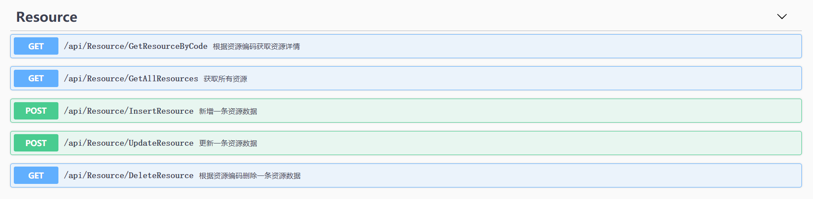
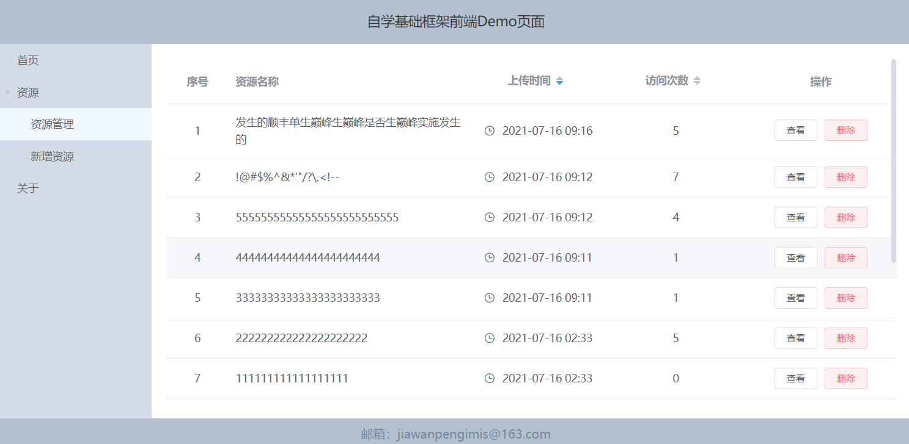
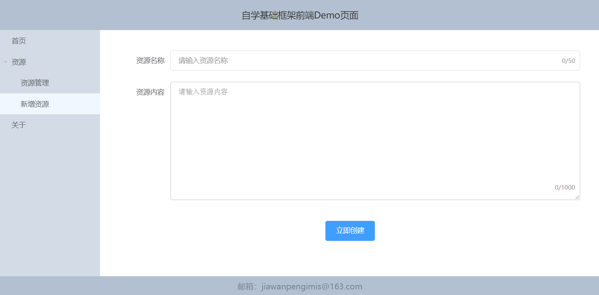
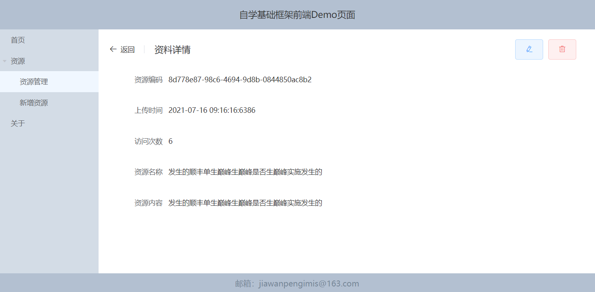

根据上文内容，我们已经完成了web项目的搭建与基础配置，下面我们来实现一个业务模块示例。我们以资源模块为例，对接webapi提供的“增删查改”业务功能。

## 实现模块接口对接
### 1.封装模块接口
在api文件夹中新增ResourceService.js用于存放后台对应的接口：
```js
import { get, post } from './http'

export const resourceService = {
    GetResourceByCode: param => get('/api/Resource/GetResourceByCode', param),
    GetAllResources: param => get('/api/Resource/GetAllResources', param),
    InsertResource: param => post('/api/Resource/InsertResource', param),
    UpdateResource: param => post('/api/Resource/UpdateResource', param),
    DeleteResource: param => get('/api/Resource/DeleteResource', param)
};
```
一一对应后台接口，方便后期的维护，如图：


### 2.实现接口调用
* 在要使用接口的视图中注入接口层：
```js
import { resourceService } from '@/api/ResourceService';
```
* 在相关业务代码中使用接口获取数据：
```js {1-2,6-9}
resourceService.InsertResource(this.resData)
    .then(redata => {
        this.$store.commit('setAppLoading', false);
        this.$router.push("/Resource/Manage");
        this.$message.success("资源创建成功");
    })
    .catch(err => {
        this.$store.commit('setAppLoading', false);
    });
```

## 实现模块业务功能
### 1. 添加页面组件
在项目中添加如下组件，用于实现资源模块的业务功能：
* src/views/Resource/Resource.vue:资源模块母版页（二级路由）
* src/views/Resource/AddResource.vue:新增资源模块
* src/views/Resource/ResourceDetail.vue:资源详情与编辑模块
* src/views/Resource/ResourceManage.vue:资源管理模块
* src/components/Resource/ResourceManage.vue:资源信息展示组件
### 2. 添加模块路由
在router/index.js下引入异步组件：
```js
/* 资源管理模块 */
const Resource = () => import(/* webpackChunkName: "resource" */ "@/views/Resource/Resource.vue");
const ResourceManage = () => import(/* webpackChunkName: "resourceManage" */ "@/views/Resource/ResourceManage.vue");
const AddResource = () => import(/* webpackChunkName: "addResource" */ "@/views/Resource/AddResource.vue");
const ResourceDetail = () => import(/* webpackChunkName: "resourceDetail" */ "@/views/Resource/ResourceDetail.vue");
```
* 向routes中插入以下对象配置路由节点（*配置在Redirect之前，以防正常访问被拦截*）：
```js 
    {
        path: "/Resource",
        meta: {
            title: '资源',
            showInTree: true
        },
        component: Resource,
        redirect: "/Resource/Manage",
        children: [
            {
                path: "/Resource/Manage",
                meta: {
                    title: '资源管理',
                    showInTree: true
                },
                component: ResourceManage
            },
            {
                path: "/Resource/AddResource",
                meta: {
                    title: '新增资源',
                    showInTree: true
                },
                component: AddResource
            },
            {
                path: "/Resource/Detail/:rescode",
                meta: {
                    title: '资料详情',
                    showInTree: false
                },
                component: ResourceDetail
            }
        ]
    }
```
### 3. 对接页面组件
* 通过element-ui快速构建各页面组件，并参照 [实现模块接口对接](#实现模块接口对接) 对接业务接口；
* 页面间跳转通过this.$router实现，例：
```js
this.$router.push("/Resource/Detail/" + resource.resCode);
```
* 最终实现效果参照：  
[http://fscbaseweb.lakesideknight.com/Resource/Manage](http://fscbaseweb.lakesideknight.com/Resource/Manage)
  




