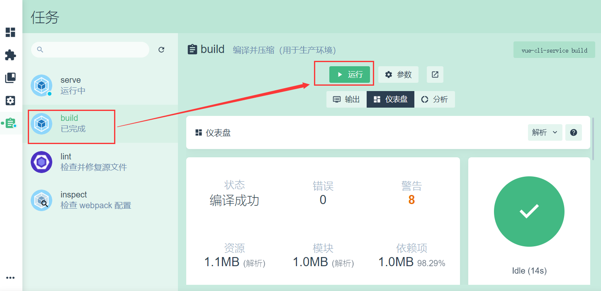
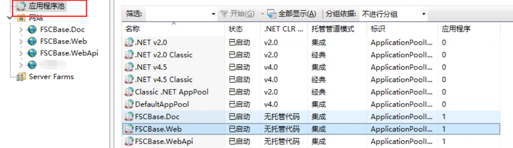
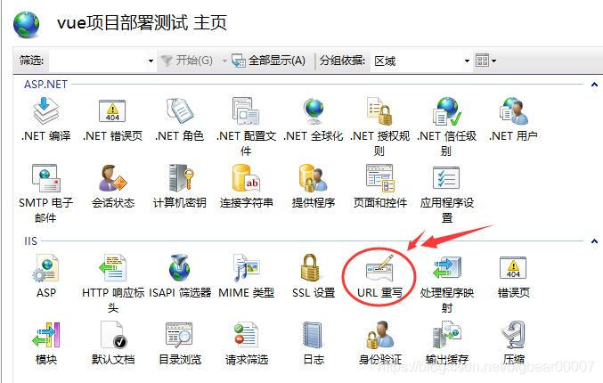
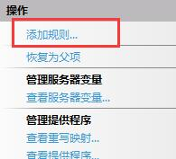
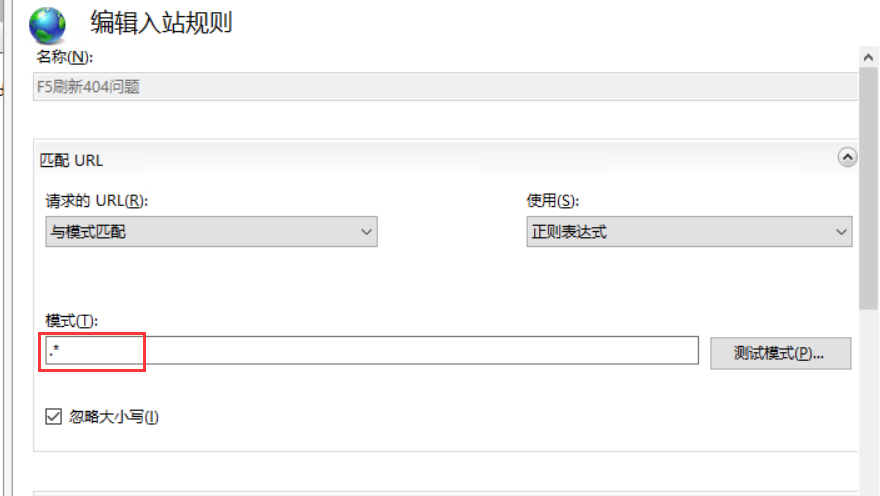
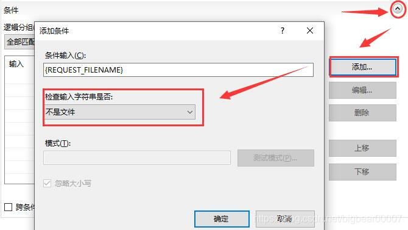
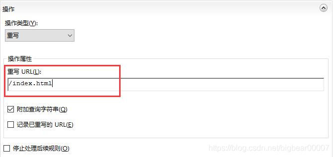

## 编译项目
切换到build图形化界面，点击运行开始编译项目：
<br/>
编译完成后，生成的文件在项目根目录的dist文件夹内。

## 部署站点
* 在远程服务器新建站点FSCBase.WebApi，配置站点目录和主机名等信息；
* 选择应用程序池，将对应站点设置为“无托管代码”；<br/>

* 将编译生成的文件放到站点目录下；

## 配置url重写
此时进入站点访问正常，但是当访问地址非首页，刷新浏览器时会提示404，这是因为我们站点是单页应用，需要配置服务端将所有页面请求重定向到首页，让js处理你的路由，服务端配置如下：
### 1.安装urlrewrite
>[https://www.iis.net/downloads/microsoft/url-rewrite](https://www.iis.net/downloads/microsoft/url-rewrite)
### 2.配置重写规则
* 安装好urlrewrite之后，在IIS的图界面会看到"URL 重写"；<br/>

* 双击之后，进入URL重写界面，在右上角点击"添加规则"；<br/>

* 选择"空白规则"，进入规则设置界面；<br/>

* 手动展开"条件"选项，添加一个"条件"，选择"不是文件"；<br/>

* 手动展开"操作"选项，设置"重写URL"为"/index.html"，然后点击右上角应用，重写URL的规则就配置完成；<br/>

### 3.后续部署简化
经过上面的配置之后，会在站点根目录生成一个web.config文件，通过xml描述了你的配置规则，如下：
```xml
<?xml version="1.0" encoding="UTF-8"?>
<configuration>
    <system.webServer>
        <rewrite>
            <rules>
                <rule name="F5刷新404问题">
                    <match url=".*" />
                    <conditions>
                        <add input="{REQUEST_FILENAME}" matchType="IsFile" negate="true" />
                    </conditions>
                    <action type="Rewrite" url="/index.html" />
                </rule>
            </rules>
        </rewrite>
    </system.webServer>
</configuration>
```

将该web.config文件拷贝到项目public文件夹下，这样以后build时便可以自动放到站点根目录下，在安装了urlrewrite的IIS服务器中直接完成配置。 

**至此vue app完成部署，可以正常访问了。**

## 集成CI/CD
> [!WARNING]
> 待完善
