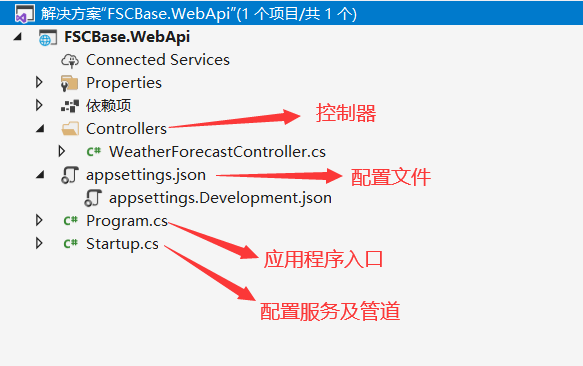

## 架构简介
| 项目名称 | 说明 |
| ------------- |-------------|
| FSCBase.Common  | 公共工具层，存放各种工具类 |
| FSCBase.DB      | 数据库连接层，包括数据库配置等 |
| FSCBase.DTO     | 数据传输层，用于提供展示给用户的数据 |
| FSCBase.Entity  | 数据实体层，用于ORM对象关系映射 |
| FSCBase.Repository  | 数据仓储层，封装DB操作的实现 |
| FSCBase.Service | 服务层，用于响应接口请求，调用Repository中的数据操作，根据业务需要组装接口所需数据并返回 |
| FSCBase.WebApi  | WebApi层，对外提供接口 |

## 创建项目
### 1. 创建解决方案
选择ASP.NET Core Web应用程序，创建解决方案与WebApi项目。<br/>


### 2. 选择项目模板
选择最新的LTS版本支持框架ASP.NET Core 3.1；<br/>
由于本项目为纯后端项目，仅对web及移动端提供webapi接口，因此此处选择API模板，根据实际业务取消勾选“为HTTPS配置”。<br/>


### 3. 完成解决方案创建
创建后的FSCBase.WebApi项目目录结构如图所示：<br/>


## 完善项目基础设施
### 1. 完善配置文件
```json{10-14}
//appsettings.json
{
  "Logging": {
    "LogLevel": {//日志级别
      "Default": "Information",
      "Microsoft": "Warning",
      "Microsoft.Hosting.Lifetime": "Information"
    }
  },
  "AllowedHosts": "*",
  "Version": "1.0.0.1",//版本号
  "ConnectionStrings": { //数据库连接串
    "FSCBaseDBConnection": "server=localhost;database=FSCBaseDB;Trusted_Connection=true"
  }
}
```

### 2. 注入配置服务
```csharp
//Startup.cs
//用于访问appsettings.json中的配置信息
private IConfiguration _configuration;
//添加构造方法，将IConfiguration服务注入
public Startup(IConfiguration configuration)
   {
       _configuration = configuration;
   }
```

### 3. 配置Http请求处理管道
在Startup.cs的Configure方法中，添加路由中间件与终止中间件，如下：
```csharp
//添加路由中间件
app.UseRouting();
//使用MVC默认路由中间件
app.UseEndpoints(endpoints =>
{
    endpoints.MapControllerRoute("default", "{controller=Home}/{action=Index}");
});
```

### 4. cors跨域服务配置
4.1 在Startup.cs的ConfigureServices方法中，添加跨域策略如下：
```csharp
//添加跨域策略
services.AddCors(options => {
   options.AddPolicy("any", builder => { builder.AllowAnyOrigin().AllowAnyMethod().AllowAnyHeader(); });
});
```
4.2 在http请求管道中添加跨域中间件，必须位于路由中间件与终止中间件之间，如下：
```csharp
//添加路由中间件
app.UseRouting();
//添加跨域中间件
app.UseCors("any");
//使用MVC默认路由中间件
app.UseEndpoints(endpoints =>
{
    endpoints.MapControllerRoute("default", "{controller=Home}/{action=Index}");
});
```

## 完成架构设计
按照[架构简介](#架构简介)添加其他项目扩展框架<br/>


