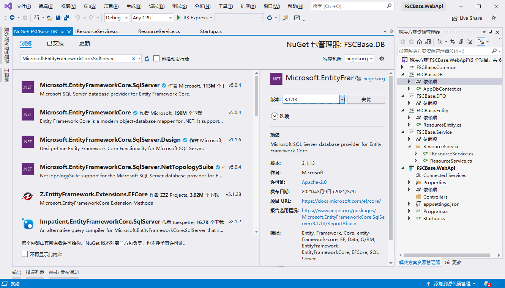
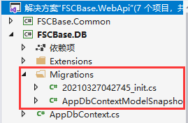
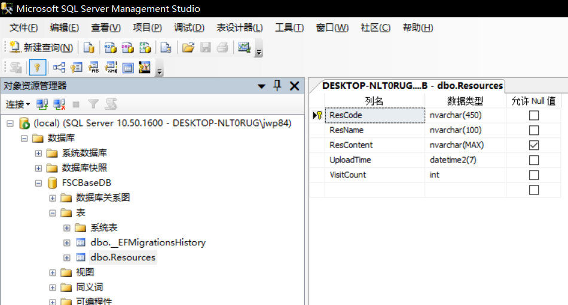

## 依赖库安装
FSCBase.DB项目通过Nuget安装如下的包：
* Microsoft.EntityFrameworkCore
* Microsoft.EntityFrameworkCore.Tools
* Microsoft.EntityFrameworkCore.SqlServer
* Microsoft.EntityFrameworkCore.Relational
FSCBase.WebApi项目通过Nuget安装如下的包：
* Microsoft.EntityFrameworkCore.Design

> [!TIP]
>各包根据项目框架选择3.1版本，如下：<br/>
>

## EFCore的初步使用
### 1. 创建数据实体类
创建数据实体类，表示数据表与键，例如下面，创建资源实体类：
```csharp
    public class ResourceEntity
    {
        [Key]
        [Required]
        /// <summary>
        /// 资源ID
        /// </summary>
        public string ResCode { get; set; }
        [Required]
        [MaxLength(100)]
        /// <summary>
        /// 资源名
        /// </summary>
        public string ResName { get; set; }
        /// <summary>
        /// 资源内容
        /// </summary>
        public string ResContent { get; set; }
        [Required]
        /// <summary>
        /// 上传时间
        /// </summary>
        public DateTime UploadTime { get; set; }
        [Required]
        [DefaultValue(0)]
        /// <summary>
        /// 浏览人数
        /// </summary>
        public int VisitCount { get; set; }
    }
```
### 2. 增加数据库上下文实体
在FSCBase.DB中新增一个数据库上下文实体类AppDbContext.cs，如下：
```csharp
    public class AppDbContext : DbContext
    {
        //DbContextOptions实例负责承载应用中的配置信息，如连接字符串、数据库提供商等内容
        public AppDbContext(DbContextOptions<AppDbContext> options) : base(options)
        {

        }

        //定义要映射到数据库中的表
        public DbSet<ResourceEntity> Resources { get; set; }
    }
```
### 3. 注册数据库上下文到IOC容器
在Startup.cs的ConfigureServices添加如下方法：
```csharp
        /// <summary>
        /// 注册数据库上下文到IOC容器
        /// </summary>
        /// <param name="services"></param>
        private void AddDBService(IServiceCollection services)
        {
            //使用Sqlserver数据，通过IConfiguration访问去获取，自定义名称的"FSCBaseDBConnection"作为我们的链接字符串
            //向依赖注入容器中注册程序中的DbContext类
            services.AddDbContextPool<AppDbContext>(
            options => options.UseSqlServer(_configuration.GetConnectionString("FSCBaseDBConnection")));

        }
```
### 4. appsettings.json 添加数据库配置
在appsettings.json中添加数据库连接串
```json{12-14}
//appsettings.json
{
  "Logging": {
    "LogLevel": {//日志级别
      "Default": "Information",
      "Microsoft": "Warning",
      "Microsoft.Hosting.Lifetime": "Information"
    }
  },
  "AllowedHosts": "*",
  "Version": "1.0.0.1",//版本号
  "ConnectionStrings": { //数据库连接串
    "FSCBaseDBConnection": "server=localhost;database=FSCBaseDB;Trusted_Connection=true"
  }
}
```
### 5. 增加初始化迁移
**设置FSCBase.DB为启动项目**，点击**VS工具->NuGet包管理器->程序包管理控制台**执行以下脚本：
```text
add-migration init -s FSCBase.WebApi
```
成功后项目内会自动增加如下文件：<br/>


### 6. 生成数据库
**设置FSCBase.WebApi为启动项目**，执行以下脚本生成数据库：
```text
update-database
```
数据库自动创建成功后如下：<br/>



