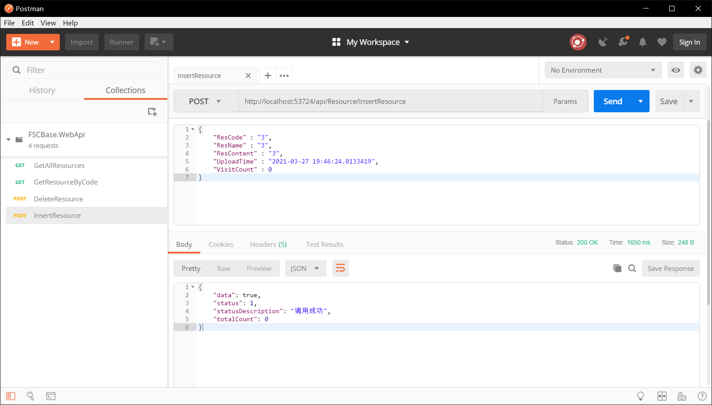
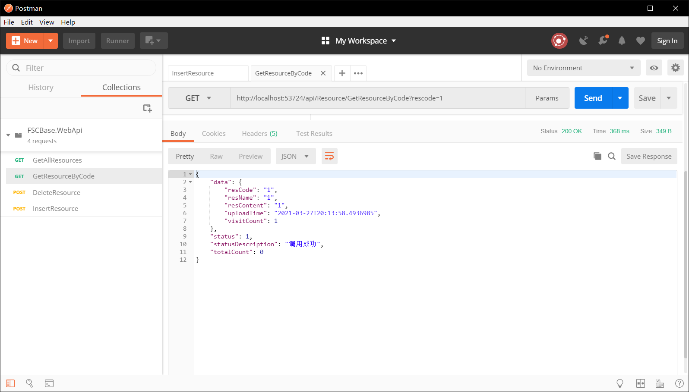

根据上文内容，我们已经完成了项目的搭建与数据库的基础配置，下面我们来实现一个业务模块示例。我们以资源为例，增加一个对资源信息“增删查改”的业务模块。

## 构建业务模块
### 构建业务模块前的准备
1. 新增ApiResponse.cs用于统一接口返回数据
```csharp
    /// <summary>
    /// Api返回结构
    /// </summary>
    public class ApiResponse<T>
    {
        /// <summary>
        /// 返回的数据
        /// </summary>
        public T Data { get; set; }
        /// <summary>
        /// 状态（成功与否，失败并与错误描述对应）
        /// </summary>
        public ApiResultStatus Status { get; set; } = ApiResultStatus.success;
        /// <summary>
        /// 错误描述
        /// </summary>
        public string StatusDescription { get; set; } = "调用成功";
        /// <summary>
        /// 数据总量
        /// </summary>
        public int TotalCount { get; set; } = 0;
    }

    /// <summary>
    /// ApiResponse结果枚举
    /// </summary>
    public enum ApiResultStatus
    {
        /// <summary>
        /// 成功
        /// </summary>
        success = 1,
        /// <summary>
        /// 参数有误
        /// </summary>
        paraError = 2,
        /// <summary>
        /// 接口内部出错
        /// </summary>
        accessError = 3,
        /// <summary>
        /// token失效
        /// </summary>
        tokenTimeOut = 4
    }
```
1. 新增控制器基类MyControllerBase.cs，继承ControllerBase类，用于统一管理对外提供的控制器：
```csharp
    [ApiController]
    [Route("api/[controller]/[action]")]
    public class MyControllerBase : ControllerBase
    {
        protected readonly ILogger _logger;

        public MyControllerBase(ILogger<MyControllerBase> logger)
        {
            _logger = logger;
        }
    }
```
### 1. 添加服务接口
在FSCBase.Service中，新增IResourceService.cs，定义资源模块功能接口：
```csharp
    /// <summary>
    /// 资源管理接口
    /// </summary>
    public interface IResourceService
    {
        Task<ApiResponse<ResourceEntity>> GetResourceByCode(string rescode);
        Task<ApiResponse<IEnumerable<ResourceEntity>>> GetAllResources();
        Task<ApiResponse<bool>> InsertResource(ResourceEntity resource);
        Task<ApiResponse<bool>> UpdateResource(ResourceEntity resource);
        Task<ApiResponse<bool>> DeleteResource(string rescode);
    }
```
### 2. 添加服务实现
在FSCBase.Service中，新增ResourceService.cs，定义资源模块功能：
```csharp
    public class ResourceService: IResourceService
    {
        public readonly IResourceRepository _resourceRepository;

        public ResourceService(IResourceRepository resp)
        {
            _resourceRepository = resp;
        }

        public Task<ApiResponse<ResourceEntity>> GetResourceByCode(string rescode)
        {
            return Task.Run(() => {
                ApiResponse<ResourceEntity> response = new ApiResponse<ResourceEntity>();
                try
                {
                    response.Data = _resourceRepository.GetResourceByCode(rescode);
                }
                catch (Exception e)
                {
                    response.Status = ApiResultStatus.accessError;
                    response.StatusDescription = e.ToString();
                }
                return response;
            });
        }

        public Task<ApiResponse<IEnumerable<ResourceEntity>>> GetAllResources()
        {
            return Task.Run(() => {
                ApiResponse<IEnumerable<ResourceEntity>> response = new ApiResponse<IEnumerable<ResourceEntity>>();
                try
                {
                    response.Data = _resourceRepository.GetAllResources();
                }
                catch (Exception e)
                {
                    response.Status = ApiResultStatus.accessError;
                    response.StatusDescription = e.ToString();
                }
                return response;
            });
        }

        public Task<ApiResponse<bool>> InsertResource(ResourceEntity resource)
        {
            return Task.Run(() => {
                ApiResponse<bool> response = new ApiResponse<bool>();
                try
                {
                    resource.ResCode = Guid.NewGuid().ToString();
                    resource.UploadTime = DateTime.Now;
                    response.Data = _resourceRepository.InsertResource(resource);
                }
                catch (Exception e)
                {
                    response.Status = ApiResultStatus.accessError;
                    response.StatusDescription = e.ToString();
                }
                return response;
            });
        }

        public Task<ApiResponse<bool>> UpdateResource(ResourceEntity updateResource)
        {
            return Task.Run(() => {
                ApiResponse<bool> response = new ApiResponse<bool>();
                try
                {
                    response.Data = _resourceRepository.UpdateResource(updateResource);
                }
                catch (Exception e)
                {
                    response.Status = ApiResultStatus.accessError;
                    response.StatusDescription = e.ToString();
                }
                return response;
            });
        }

        public Task<ApiResponse<bool>> DeleteResource(string rescode)
        {
            return Task.Run(() => {
                ApiResponse<bool> response = new ApiResponse<bool>();
                try
                {
                    response.Data = _resourceRepository.DeleteResource(rescode);
                }
                catch (Exception e)
                {
                    response.Status = ApiResultStatus.accessError;
                    response.StatusDescription = e.ToString();
                }
                return response;
            });
        }

    }
```

### 3. 添加仓储接口
在FSCBase.Repository中，新增IResourceRepository.cs，定义资源模块仓储接口：
```csharp
    public interface IResourceRepository
    {
        ResourceEntity GetResourceByCode(string rescode);
        IEnumerable<ResourceEntity> GetAllResources();
        bool InsertResource(ResourceEntity resource);
        bool UpdateResource(ResourceEntity resource);
        bool DeleteResource(string rescode);
    }
```

### 4. 添加仓储实现
在FSCBase.Repository中，新增ResourceRepository.cs，定义资源仓储模块数据操作功能：
```csharp
    /// <summary>
    /// 资源仓储服务
    /// </summary>
    public class ResourceRepository: IResourceRepository
    {
        private readonly AppDbContext _context;

        public ResourceRepository(AppDbContext context)
        {
            _context = context;
        }

        public ResourceEntity GetResourceByCode(string rescode)
        {
            ResourceEntity resource = _context.Resources.FirstOrDefault(a => a.ResCode == rescode);
            if (resource != null) resource.VisitCount++;
            _context.SaveChanges();
            return resource;
        }

        public IEnumerable<ResourceEntity> GetAllResources()
        {
            return _context.Resources.AsEnumerable();
        }

        public bool InsertResource(ResourceEntity resource)
        {
            _context.Resources.Add(resource);
            _context.SaveChanges();
            return true;
        }

        public bool UpdateResource(ResourceEntity updateResource)
        {
            ResourceEntity resource = _context.Resources.FirstOrDefault(s => s.ResCode == updateResource.ResCode);
            if (resource != null)
            {
                resource.ResName = updateResource.ResName;
                resource.ResContent = updateResource.ResContent;
                _context.SaveChanges();
                return true;
            }
            return false;
        }

        public bool DeleteResource(string rescode)
        {
            ResourceEntity resource = _context.Resources.FirstOrDefault(a => a.ResCode == rescode);
            if (resource != null)
            {
                _context.Resources.Remove(resource);
                _context.SaveChanges();
                return true;
            }
            return false;
        }
    }
```

### 5. 注册服务和仓储
在IOC容器中注册上述资源管理模块的服务和仓储：
```csharp
    services.AddScoped<IResourceService, ResourceService>();
    services.AddScoped<IResourceRepository, ResourceRepository>();
```

### 6. 添加资源模块Controller
新增ResourceController类继承控制器基类对外提供接口：
```csharp
    [AllowAnonymous]
    [ApiController]
    public class ResourceController : MyControllerBase
    {
        private IResourceService _resourceService;

        public ResourceController(IResourceService resourceService, ILogger<ResourceController> logger) : base(logger)
        {
            _resourceService = resourceService;
        }

        /// <summary>
        /// 根据资源编码获取资源详情
        /// </summary>
        /// <param name="rescode">资源编码</param>
        /// <returns></returns>
        [HttpGet]
        public async Task<ApiResponse<ResourceEntity>> GetResourceByCode(string rescode)
        {
            var response = await _resourceService.GetResourceByCode(rescode);
            return response;
        }

        /// <summary>
        /// 获取所有资源
        /// </summary>
        /// <returns></returns>
        [HttpGet]
        public async Task<ApiResponse<IEnumerable<ResourceEntity>>> GetAllResources()
        {
            var response = await _resourceService.GetAllResources();
            return response;
        }

        /// <summary>
        /// 新增一条资源数据
        /// </summary>
        /// <param name="resource">资源数据</param>
        /// <returns></returns>
        [HttpPost]
        public async Task<ApiResponse<bool>> InsertResource(ResourceEntity resource)
        {
            var response = await _resourceService.InsertResource(resource);
            return response;
        }

        /// <summary>
        /// 更新一条资源数据
        /// </summary>
        /// <param name="updateResource">资源数据</param>
        /// <returns></returns>
        [HttpPost]
        public async Task<ApiResponse<bool>> UpdateResource(ResourceEntity updateResource)
        {
            var response = await _resourceService.UpdateResource(updateResource);
            return response;
        }

        /// <summary>
        /// 根据资源编码删除一条资源数据
        /// </summary>
        /// <param name="rescode">资源编码</param>
        /// <returns></returns>
        [HttpPost]
        public async Task<ApiResponse<bool>> DeleteResource(string rescode)
        {
            var response = await _resourceService.DeleteResource(rescode);
            return response;
        }
    }
```

## 增加种子数据
在FSCBase.DB的Extensions文件夹中找到ModelBuilderExtensions类，向其中写入调试用的种子数据，如下：
```csharp
    public static class ModelBuilderExtensions
    {
        public static void Seed(this ModelBuilder modelBuilder)
        {
            for(int i = 1; i < 7; i++)
            {
                modelBuilder.Entity<ResourceEntity>().HasData(
                     new ResourceEntity
                     {
                         ResCode = Guid.NewGuid().ToString(),
                         ResName = $"资料{i}",
                         ResContent = $"资料{i}的内容",
                         UploadTime = DateTime.Now,
                         VisitCount = 0
                     }
                 );
            }
        }
    }
```
在程序包管理器控制台执行下面两行代码，更新数据库：
```text
    add-migration addseeddata -s FSCBase.WebApi
    update-database
```

## 业务模块接口测试
运行项目，通过PostMan调用以上接口，结果如下：<br/>
<br/>



