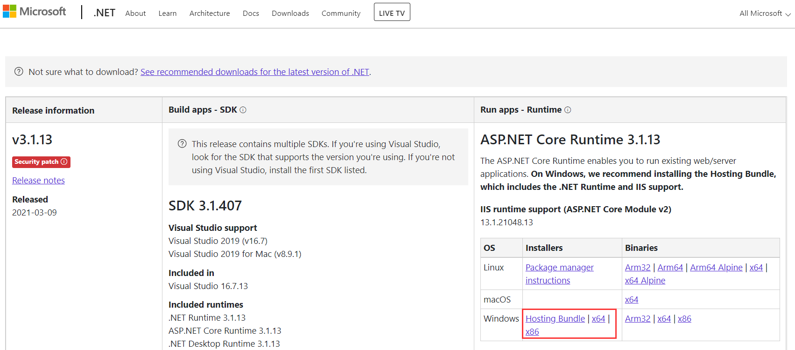
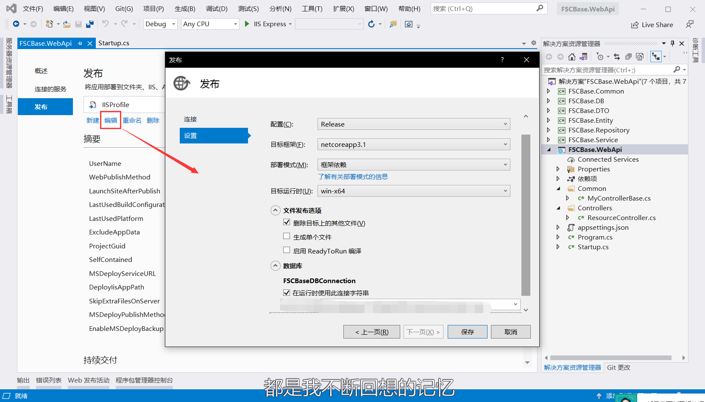
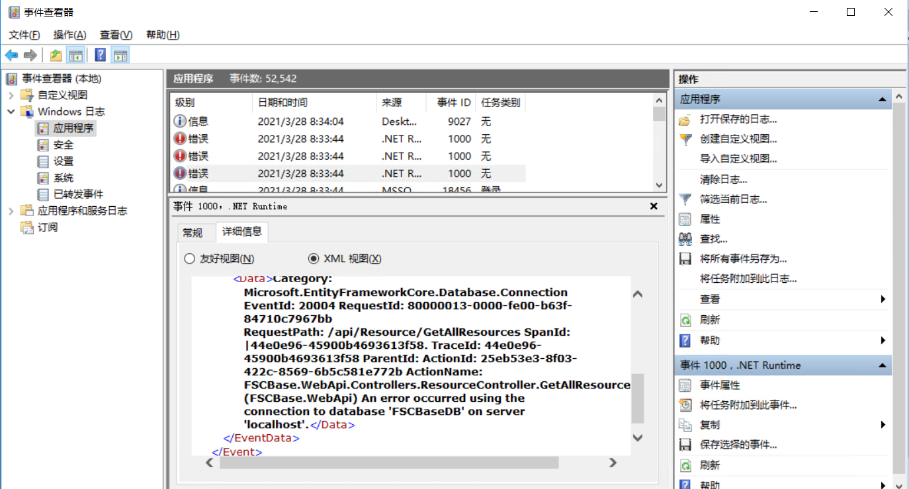

> [!TIP]
>.netcore webapi项目在IIS中部署存在两种模式：
>* **框架依赖：** 需要服务器安装相关运行时，发布包体积小
>* **独立：** 无需服务器安装相关运行时，发布时自动抽取相关库发布，但是包体积会增加50MB左右
> 本次采用框架依赖模式进行部署

## 服务端环境安装
IIS服务器上安装 core Runtime 3.1.13和Hosting Bundle 3.1.13 这2个安装包，安装完成后重启IIS。
[https://dotnet.microsoft.com/download/dotnet/3.1](https://dotnet.microsoft.com/download/dotnet/3.1)

## VS发布站点
1. 在远程服务器新建站点FSCBase.WebApi，并将应用程序池设置为“无托管代码”； 
2. 在FSCBase.WebApi项目上右键选择 发布-> Web服务器(IIS) -> Web部署，填写远程服务器信息；
3. 进一步进行发布配置，如图：

## 问题排查与调试
发布完成后访问若遇到无法查看的问题，可以打开服务端的事件查看器，点击 windows日志 -> 应用程序 查看相关问题：

