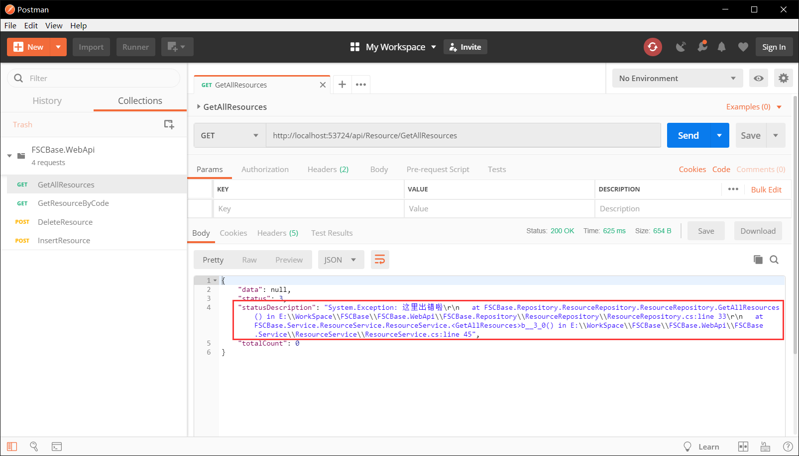
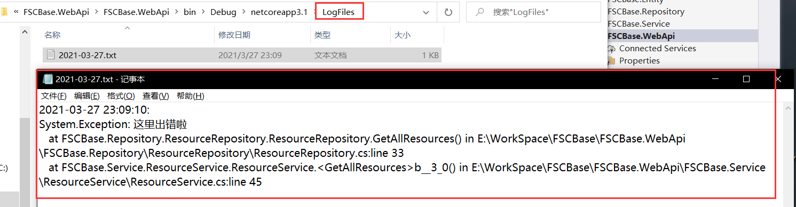
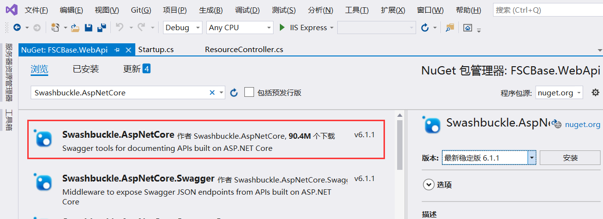
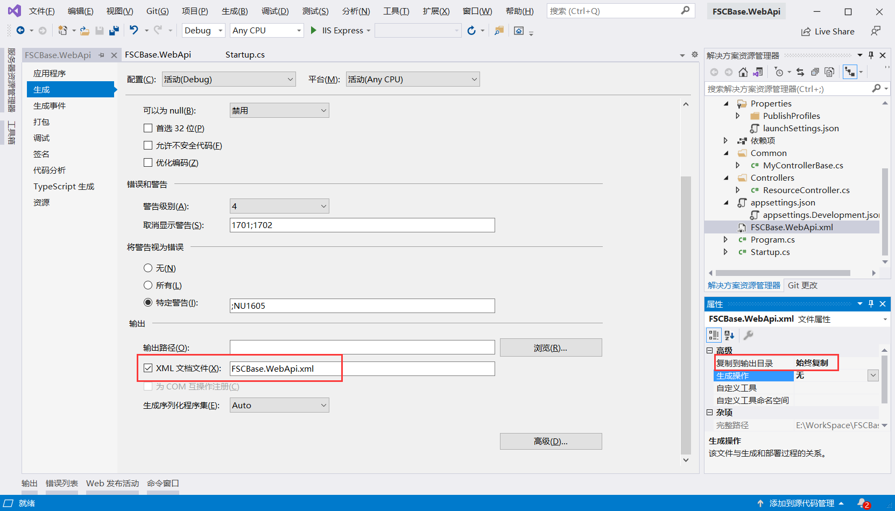
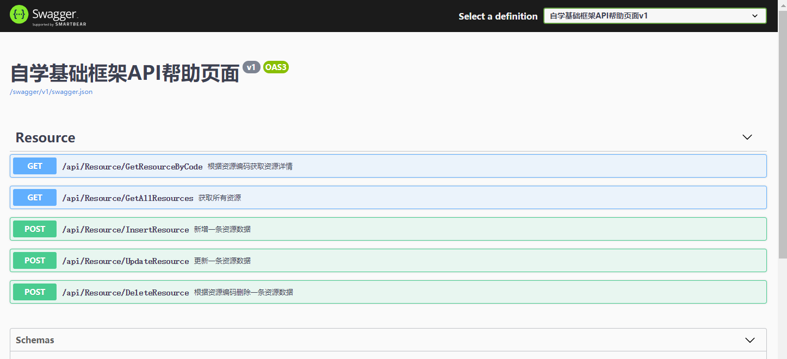
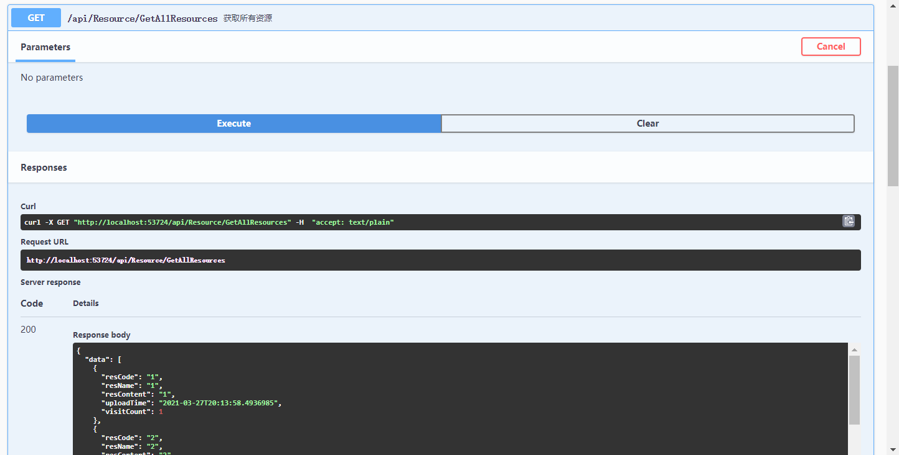

## 日志模块配置
### 1. 新增LogHelper.cs日志记录库
```csharp
    /// <summary>
    /// 日志处理方法
    /// </summary>
    public class LogHelper
    {
        /// <summary>
        /// 日志文件路径
        /// </summary>
        private static string filePath
        {
            get
            {
                return $"{AppDomain.CurrentDomain.BaseDirectory}\\LogFiles\\{DateTime.Now.ToString("yyyy-MM-dd")}.txt";
            }
        }
        /// <summary>
        /// 日志文件目录
        /// </summary>
        private static string fileDir
        {
            get
            {
                return $"{AppDomain.CurrentDomain.BaseDirectory}\\LogFiles";
            }
        }
        /// <summary>
        /// 写一条日志
        /// </summary>
        /// <param name="text"></param>
        public static void WriteLog(string text)
        {
            Task.Run(() =>
            {
                try
                {
                    if (!Directory.Exists(fileDir))
                    {
                        Directory.CreateDirectory(fileDir);

                    }
                    if (!File.Exists(filePath))
                    {
                        File.Create(filePath).Dispose();
                    }
                    using (FileStream stream = new FileStream(filePath, FileMode.Append))
                    using (StreamWriter writer = new StreamWriter(stream))
                    {
                        string timeText = DateTime.Now.ToString("yyyy-MM-dd HH:mm:ss");
                        writer.WriteLine(timeText + ":  " + text + "\r\n");
                        writer.Close();
                        writer.Dispose();
                    }
                }
                catch
                {
                    return;
                }
            });
        }
        public static void WriteLog(Exception e)
        {
            Task.Run(() =>
            {
                try
                {
                    if (!Directory.Exists(fileDir))
                    {
                        Directory.CreateDirectory(fileDir);

                    }
                    if (!File.Exists(filePath))
                    {
                        File.Create(filePath).Dispose();
                    }
                    using (FileStream stream = new FileStream(filePath, FileMode.Append))
                    using (StreamWriter writer = new StreamWriter(stream))
                    {
                        string timeText = DateTime.Now.ToString("yyyy-MM-dd HH:mm:ss");
                        writer.WriteLine(timeText + ": " + "\r\n" + e.ToString());
                        writer.Close();
                        writer.Dispose();
                    }
                }
                catch
                {
                    return;
                }
            });
        }
    }
```

### 2. 调用日志记录功能
>如接口的try catch中 

```csharp{13}
    public Task<ApiResponse<IEnumerable<ResourceEntity>>> GetAllResources()
        {
            return Task.Run(() => {
                ApiResponse<IEnumerable<ResourceEntity>> response = new ApiResponse<IEnumerable<ResourceEntity>>();
                try
                {
                    response.Data = _resourceRepository.GetAllResources();
                }
                catch (Exception e)
                {
                    response.Status = ApiResultStatus.accessError;
                    response.StatusDescription = e.ToString();
                    LogHelper.WriteLog(e);
                }
                return response;
            });
        }
```
接口出错时，前端可以获取到出错标志及内容进行相应处理，如图：

接口出错时，后端日志记录位置及内容如图：


### 3. 全局错误拦截及日志记录
> [!WARNING]
> 待完善


## swagger配置
### 1. 引用swagger库
在NuGet里面搜索Swashbuckle.AspNetCore包进行安装：

### 2. 引用查看Api注释的库
在NuGet里面搜索Microsoft.Extensions.PlatformAbstractions包进行安装：
### 3. 添加swagger服务
在Startup类的ConfigureServices方法里面注入服务：
```csharp
    services.AddSwaggerGen(options =>
    {
        options.SwaggerDoc("v1", new OpenApiInfo { Title = "自学基础框架API帮助页面", Version = "v1" });
        // 获取xml文件名
        var xmlFile = $"{Assembly.GetExecutingAssembly().GetName().Name}.xml";
        // 获取xml文件路径
        var xmlPath = Path.Combine(AppContext.BaseDirectory, xmlFile);
        // 添加控制器层注释，true表示显示控制器注释
        options.IncludeXmlComments(xmlPath, true);
    });
```
### 4. 添加swagger中间件
在Startup类的Configure方法里面添加Swagger有关的中间件：
```csharp
    // 添加Swagger有关中间件
    app.UseSwagger();
    app.UseSwaggerUI(c =>
    {
        c.SwaggerEndpoint("/swagger/v1/swagger.json", "自学基础框架API帮助页面v1");
    });
```
### 5. 配置XML输出路径
项目右键，选择属性，勾选“XML文档文件”，如下图所示：<br/>

### 6. 访问swagger页面
运行程序，访问swagger地址：
>http://localhost:5000/swagger/index.html <br/>

访问swagger首页如下：

点击某个接口，在右上角点击"try in out"，可以方便地进行接口调试，如下：


## 接口加密配置
> [!WARNING]
> 待完善

## 集成CI/CD
> [!WARNING]
> 待完善
